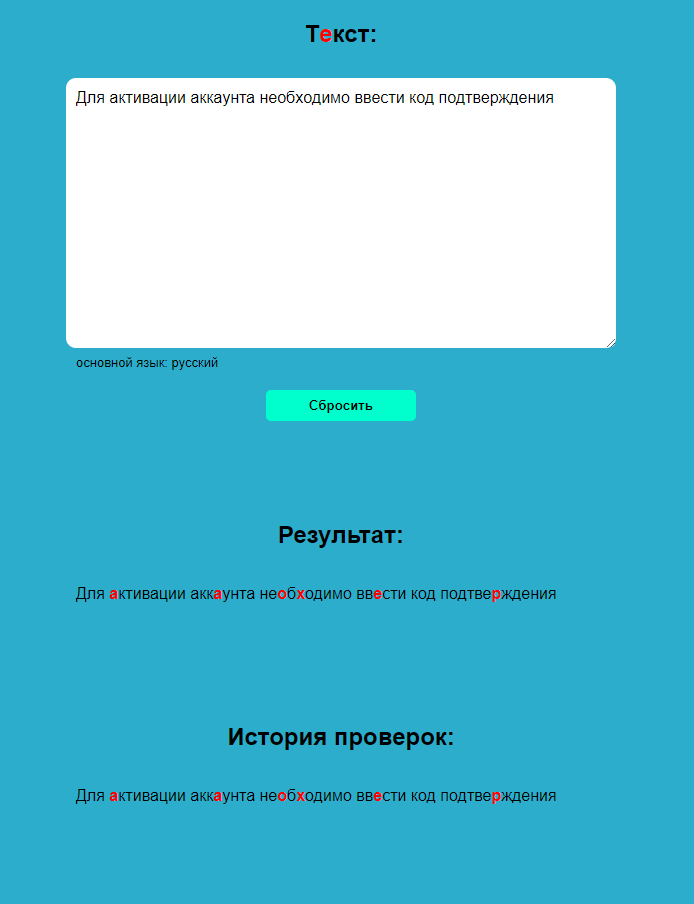

# Раскладка

---

#### Стек:

Backend: Node.js (18.13), express (4.18.2), mongoDB (6.0.4), mongoose (6.10)

Frontend: HTML, CSS, JS, module, ООП

#### Описание

Приложение находит и подсвечивает символы, которые не соответствуют языку введенной строки.
Основные языки: русский и английский.
Определение языка происходит путем подсчета количества символов.
При одинаковом количестве символов в приоритете русский

#### Пример

Пользователь вводит в форму строку: «Для aктивации аккaунта неoбxодимо ввeсти код подтвеpждения».
Строка в примере содержит латинские символы, они выделены жирным шрифтом.
Нажав на кнопку проверки определяется язык строки и подсвечиваются символы, которые ему не соответствуют.
Строка сохраняется в истории использования. После исправления найденных символов на правильные,
в данном случае на кириллицу, повторная проверка запускается автоматически.

#### Задание

Техническое задание Ориентируясь на предметное описание и пример,
позволяющую вводить текст произвольной длины и отображать результат проверки по нажатию на кнопку проверки.
Если пользователь исправляет найденные символы после их подсветки, повторную проверку запускать автоматически,
без нажатия на кнопку проверки. Также необходимо реализовать отображение истории проверок, которая была сохранена в базе данных.
Историю проверки сохранять при первичном запросе, т.е. при нажатии кнопки проверки.
После исправления строки и автоматического запуска повторной проверки сохранять историю не нужно.
Определение языка строки, поиск символов в ней и сохранение в базу данных должно происходить на стороне

#### Как запустить:
Клонировать репозиторий.
На вашей машине должна быть СУБД [mongoDB](https://www.mongodb.com/try/download/community-kubernetes-operator).
В терминале запустите БД командой 'mongod'.
В терминале перейти в директорию проекта в папку 'backend' и установить зависимости командой 'npm i'.
Запустить сервер командой 'npm run start' из директории 'backend'.
Запустить 'frontend' на [локальном сервере](https://www.npmjs.com/package/serve) из директории frontend.
